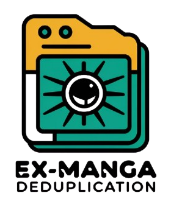
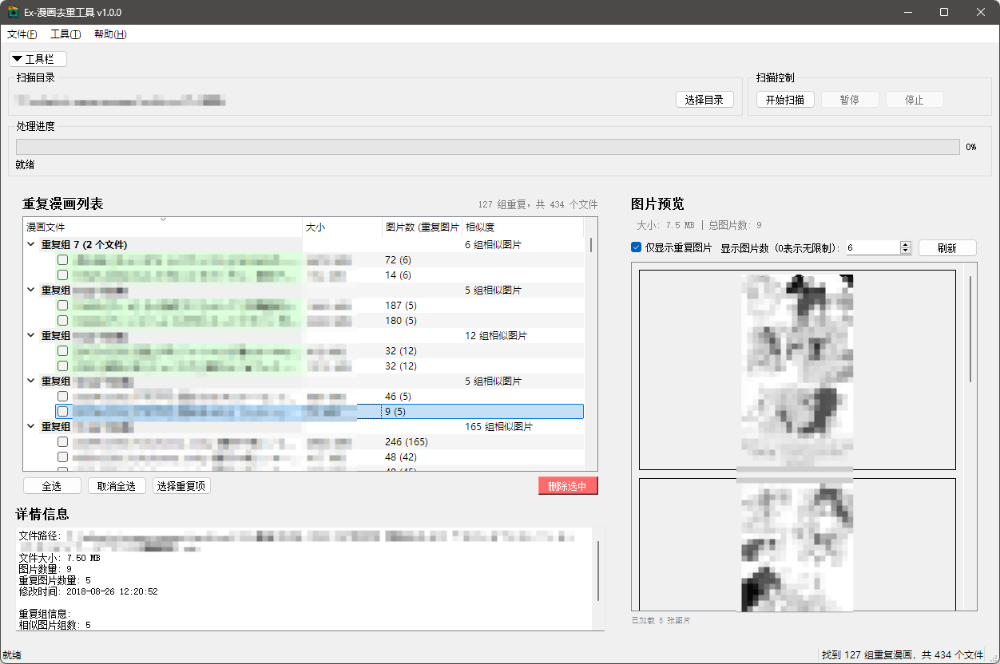

# Ex漫画去重工具 📚✨



一个功能强大的漫画重复文件检测工具，支持多种压缩格式和图像哈希算法。



## 功能特性 ✨

### 核心功能 🚀
- **多格式支持**: 支持 ZIP、RAR、CBZ、CBR 格式的漫画文件和漫画文件夹 📁
- **图片哈希**: 支持多种图像哈希算法进行重复检测 🖼️
- **可配置阈值**: 支持自定义相似度阈值和最小相似图片数量 ⚙️
- **图片预览**: 提供漫画内容预览功能 🔍
- **批量操作**: 支持批量删除重复文件 🗑️

### 高级功能 🌟
- **黑名单图片**: 排除不需要检测的图片 🚫
- **结果缓存**: 缓存扫描结果，提高后续扫描速度 ⚡
- **扫描控制**: 支持暂停、恢复和停止扫描 ⏸️▶️⏹️
- **纯内存读取**: 无需解压文件即可读取内容 🧠

### 用户界面 🖥️
- **直观操作**: 简洁易用的图形界面 👍
- **实时进度**: 显示扫描进度和状态 📊
- **详细信息**: 展示文件大小、图片数量等信息 ℹ️
- **右键菜单**: 便捷的文件操作选项 🖱️
- **设置面板**: 丰富的配置选项 🔧

## 算法性能 🚀

- 扫描阶段：
  - 读取所有图片并计算哈希值
  - 时间复杂度 O(n)，n 是图片数量
  - 会使用多线程加速
  - 有缓存时只计算新图片的哈希值
  - 首次运行耗时主要取决于硬盘读取性能，再次运行约**10秒**

- 处理阶段：
  - 对比所有图片的哈希值
  - 时间复杂度 O(n^2)，n 是图片数量
  - 使用 numpy 并行计算
  - 有索引时会跳过不重复的漫画
  - 4000本漫画，共300000张图片，首次运行耗时约**5分钟**，再次运行约**10秒**

## 系统要求 💻

- **操作系统**: Windows 10/11
- **Python**: 3.9 或更高版本
- **内存**: 建议 2GB 或以上
- **存储**: 至少 200MB 可用空间

## 安装说明 ⬇️

### 1. 克隆项目
```bash
git clone https://github.com/kuviki/ex-manga-deduplication
cd ex-manga-deduplication
```

### 2. 安装依赖
```bash
pip install -r requirements.txt
```

### 3. 运行程序
```bash
python main.py
```

## 使用指南 📖

### 基本使用 💡

1. **选择扫描目录**
   - 点击"选择目录"按钮选择包含漫画文件的目录
   - 支持递归扫描子目录

2. **开始扫描**
   - 点击"开始扫描"按钮
   - 程序会自动检测重复的漫画文件
   - 可以随时暂停或停止扫描
   - 进度条分扫描和处理两个阶段

3. **查看结果**
   - 扫描完成后，重复文件会按组显示
   - 点击文件可以预览漫画内容
   - 以及查看文件详细信息
   - 右键可以标记并高亮文件（下次运行标记状态会保留）

4. **删除重复文件**
   - 选择要删除的文件
   - 点击"删除选中"按钮
   - 支持智能选择（每组保留一个）

### 黑名单管理 ⛔

1. **添加黑名单**
   - 添加黑名单图片到黑名单文件夹

2. **管理黑名单**
   - 菜单栏 - 工具 - 黑名单统计
   - 菜单栏 - 工具 - 黑名单刷新

3. **应用黑名单**
   - 扫描时自动排除黑名单中的图片

## 配置文件 📝

程序会在用户目录下创建配置文件：
- `%USERPROFILE%/config.yaml`: 主配置文件
- `%USERPROFILE%/blacklist/`: 黑名单文件夹
- `%USERPROFILE%/cache/`: 缓存文件夹
- `%USERPROFILE%/index.db`: 索引文件

### 参数说明 ⚙️

- 最小相似图片数量：两两相似的漫画最少要包含的相似图片数量，两本漫画都要满足
- 最小图片宽度/高度：图片小于这个宽度或高度的不会参与检测，因为会影响缓存，所以改成只读（改这个配置要删除 cache 目录才能生效）
- 漫画最小图片数量：图片数量小于这个数量的漫画不会参与检测
- 漫画最大图片数量：图片数量大于这个数量的漫画不会参与检测

## 故障排除 🔍

### 常见问题 ❓

#### Q: 程序启动失败
A: 检查 Python 版本和依赖包是否正确安装

#### Q: 检测结果不准确
A: 调整“相似度阈值”和“最小相似图片数量”

#### Q: 扫描阶段速度过慢
A: 用 SSD 固态硬盘存放漫画和增加“最大工作线程数”

#### Q: 处理阶段占用内存过大
A: 设置“漫画最大图片数量”过滤掉图片太多的漫画

#### Q: 重复组内的漫画不重复
A: 如果漫画A和B有重复，漫画B和C有重复，哪怕漫画A和C没有重复，它们也会在同一重复组中

#### Q: 无法打开 7z 或 cb7 文件
A: 不支持，建议换其他支持的压缩格式

#### Q: 图片从黑名单中移除后重复检测结果没变化
A: 请手动删除 index.db 索引文件

#### Q: 如何检查黑名单中的图片重复
A: 如果有黑名单图片重复会输出到日志里

#### Q: 如何扫描多个不同的目录
A: 创建一个目录，使用目录联接（Junction Point）将多个目录联接到这个目录下，然后扫描这个目录

### 日志文件 📜

程序会生成详细的日志文件，位于：
- `logs/app.log`

查看日志可以帮助诊断问题。

## 开发说明 🧑‍💻

### 项目结构
```
├── main.py                 # 程序入口
├── requirements.txt        # 依赖包列表
├── README.md              # 说明文档
├── src/                   # 源代码目录
│   ├── __init__.py
│   ├── core/              # 核心功能模块
│   ├── gui/               # 用户界面模块
│   └── utils/             # 工具模块
└── logs/                  # 日志目录
```

## 许可证 📄

本项目采用 GPL v3 许可证。

## 贡献 ❤️

欢迎提交 Issue 和 Pull Request！

## 联系方式 📧

如有问题或建议，请通过以下方式联系：
- GitHub Issues

---

感谢使用本漫画去重工具！